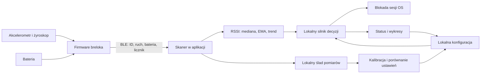
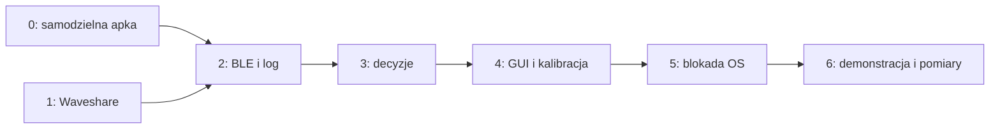

# breLock — PoC: jedna aplikacja na komputerze i jeden brelok

**Wersja:** 0.8, plan PoC i bieżący stan implementacji.  
**Data analizy:** 1 października 2026, Europe/Warsaw.  
**Aktualizacja ochrony i cyklu życia:** 3 października 2026.  
**Aktualizacja ekranu i kanału sterowania:** firmware 0.5.0; [cztery ekrany i GATT](DEVICE_UI.md). Poniższy pierwotny plan reklam BLE jest rozszerzony o ten kanał, bez serwera i dodatkowej aplikacji.  
**Sprzęt:** Waveshare ESP32-S3-Touch-LCD-1.28; rewizję potwierdzamy na egzemplarzu.  
**Rezultat:** użytkownik uruchamia lokalną aplikację, wybiera swój brelok, kalibruje go i sprawdza automatyczną blokadę komputera po odejściu.

To aktualny plan projektu. Cały PoC działa na jednej parze komputer–brelok. Konfiguracja, wykresy, historia i kalibracja znajdują się w aplikacji desktopowej. Parametry **START** są hipotezami do pierwszych prób; dane katalogowe i źródła są oznaczone osobno.

[Plan aplikacji desktopowej](PLAN_APLIKACJI_DESKTOPOWEJ.md) opisuje małe okno, funkcje, układ widoków i pracę z trayem. Wybrany frontend: **Tauri 2 + Svelte 5 + TypeScript + Vite + CSS**. Aplikacja ma granatowe okno z oddychającym ON/OFF, trzy widoki, tray i pracę w tle. Ochronę L1–L4 i blokadę sesji macOS/Windows można uzbroić świadomie po wybraniu breloka; autostart i obsługa sleep/wake pozostają dalszymi pracami. [Uruchomienie](apps/desktop/native/ui/README.md).

**Stan implementacji:** firmware Waveshare `0.5.0-poc` ma profil S3, IMU, baterię, BLE v3 i GATT oraz cztery widoki CST816S: ochrona, dystans, kalibracja i blokada po 3 s przytrzymania. Desktop w **Rust + Tauri/Svelte** pokazuje RSSI/ruch/baterię i diagnostykę, pracuje z traya, wysyła stan na brelok i zapisuje lokalnie próg z kalibracji START/ZAPISZ. Reguły L1–L4 i adaptery blokady macOS/Windows są zaimplementowane. Po pojedynczym żądaniu blokady epizod pozostaje aktywny; aplikacja uzbraja się samoczynnie ponownie, gdy brelok wróci blisko komputera na co najmniej 1 s. Build firmware i pakiet `.app` przechodzą. Po wgraniu log potwierdził BLE/GATT, IMU około 56 próbek/s, CST816S bez błędów I²C oraz przesyłanie RSSI i dystansu z PC. Fizycznego gestu/przytrzymania i skutku blokady OS nie testowano. Sleep/wake i autostart pozostają dalszymi pracami. Stary `main.py`/GUI jest historyczną ścieżką. [Firmware](apps/firmware-esp32/README.md), [backend Rust i build](apps/desktop/native/README.md), [konsola Python](apps/desktop/README.md).

## Spis treści

1. [Zakres i kryterium sukcesu PoC](#1-zakres-i-kryterium-sukcesu-poc)
2. [Architektura kodu i wykorzystanie repozytorium](#2-architektura-kodu-i-wykorzystanie-repozytorium)
3. [Sprzęt i analiza wstępna](#3-sprzęt-i-analiza-wstępna)
4. [Urządzenie i komunikacja BLE](#4-urządzenie-i-komunikacja-ble)
5. [Jedna aplikacja: interfejs i konfiguracja](#5-jedna-aplikacja-interfejs-i-konfiguracja)
6. [Logika blokowania](#6-logika-blokowania)
7. [Kalibracja i pomiary PoC](#7-kalibracja-i-pomiary-poc)
8. [Kroki implementacji](#8-kroki-implementacji)
9. [Testy i gotowość demonstracji](#9-testy-i-gotowość-demonstracji)
10. [Źródła i granice wniosków](#10-źródła-i-granice-wniosków)

## 1. Zakres i kryterium sukcesu PoC

### 1.1. Co budujemy

- Jedną aplikację Rust z interfejsem Tauri/Svelte na laptopie/komputerze demonstracyjnym, kompilowaną dla macOS i Windows.
- Jeden brelok Waveshare z firmware BLE, odczytem ruchu i baterii.
- Bezpośrednią komunikację BLE oraz lokalną identyfikację wybranego urządzenia.
- Lokalny interfejs: status, wykres RSSI/ruchu, ustawienia i kreator kalibracji.
- Tryb obserwacji oraz ręcznie włączany tryb automatycznego blokowania.
- Proste nagrywanie pomiarów i odtwarzanie ich do porównania ustawień.
- Małe okno, ikonę w pasku menu macOS / zasobniku Windows i ciągłą pracę po ukryciu okna.

PoC ma odpowiedzieć: **czy ruch z IMU poprawia decyzję o odejściu względem samego RSSI na tej konkretnej parze urządzeń?**

### 1.2. Granica zakresu

PoC nie ma panelu administratora, serwera, API HTTP, kont, logowania, firm, chmury, synchronizacji ani zarządzania wieloma komputerami. Lokalny backend Rust jest częścią aplikacji. Nie wymaga internetu. Nie projektujemy strony internetowej, instalatorów firmowych, provisionowania flotowego, OTA ani rozbudowanego własnego protokołu kryptograficznego.

Wspólny kod backendu i interfejsu budujemy osobno dla macOS i Windows. Test sprzętowy zaczynamy od laptopa demonstracyjnego; działanie BLE, traya i blokady potwierdzamy później na obu systemach, niezależnie od sukcesu kompilacji. Firmware wgrywamy przez USB. Aplikację można uruchamiać ze źródeł lub z lokalnego builda; autostart sprawdzamy na docelowym pliku programu.

### 1.3. Funkcje obowiązkowe i dodatki

| Obowiązkowe dla PoC | Dodatki dopiero po działającej demonstracji |
| --- | --- |
| Wybór jednego breloka i zapis jego ID lokalnie | Eksport CSV i odtwarzanie wielu sesji z GUI |
| RSSI, ruch, bateria, świeżość pakietów | Status laptopa przekazywany na LCD przez GATT |
| Automatyczna i ręczna blokada | Ręczna komenda blokady z dotyku breloka |
| Obserwacja, uzbrojenie i lokalna pauza | Porównanie jakości na drugim systemie OS |
| Lokalne progi, wykresy, log i kalibracja | Dalsze oszczędzanie energii po pomiarach |
| Start bez serwera i test po sleep/wake | Rozpoznawanie wzorca chodzenia, jeśli dane wykażą sens |
| Tray, ukrycie okna bez zatrzymania pracy, lokalny przełącznik autostartu | Rozbudowane porównanie pomiarów w GUI |

Dodatki nie rozszerzają systemu poza jedną aplikację i jeden brelok. FTM/UWB oraz dodatkowa stacja przy laptopie nie należą do tego PoC.

### 1.4. Zasady działania

1. Brelok mierzy aktywność; komputer mierzy RSSI i podejmuje decyzję.
2. Ruch sam w sobie nie blokuje. Szybka reguła wymaga również trendu i poziomu sygnału.
3. Brak ruchu nie anuluje blokady przy trwałym słabym lub utraconym sygnale.
4. Akcją jest blokada ekranu, nigdy wyłączanie komputera.
5. Powrót breloka nie odblokowuje OS.
6. Aplikacja startuje w obserwacji; użytkownik świadomie włącza ochronę po sprawdzeniu pomiarów i blokady.
7. PoC ma pokazywać błędy i ograniczenia, a nie udawać certyfikowany system zabezpieczeń.
8. Zamknięcie okna ukrywa je i zachowuje aktywny tryb; „Zakończ breLock — wyłącz ochronę” kończy cały program. Autostart po zalogowaniu nie oznacza automatycznego uzbrojenia.

## 2. Architektura kodu i wykorzystanie repozytorium

### 2.1. Przepływ



Urządzenie nie wylicza odległości do laptopa. Aplikacja nie wysyła pomiarów do żadnej usługi.

### 2.2. Technologia

| Część | Rozwiązanie PoC |
| --- | --- |
| Aplikacja | Rust 1.98.1 / Cargo; jeden natywny program dla macOS i Windows |
| BLE | `btleplug` 0.13.3: CoreBluetooth na Macu, WinRT na Windowsie; Tokio i kolejki |
| Frontend/wykresy | Zaplanowany Tauri 2 + Svelte 5 + TypeScript + Vite + CSS; korzysta z `Backend/AppSnapshot`, jeszcze niezaimplementowany |
| Okno i tło | Obszar treści START 380 × 520 px logicznych; tray, ukrycie po X, jedno aktywne uruchomienie backendu |
| Integracja desktopu | Tray w Rust, oficjalne pluginy Tauri autostart/single-instance; praca backendu niezależna od widoczności UI |
| Firmware | Rozbudowa istniejącego Arduino/PlatformIO w `apps/firmware-esp32` |
| Profil płytki | Osobne środowisko ESP32-S3 w `platformio.ini`, piny i pamięć według Waveshare |
| IMU/LCD/dotyk | Sprawdzone sterowniki/przykłady producenta; prosty ekran informacyjny |
| Konfiguracja | Lokalny `poc_config.json`, serde + walidacja; jawny `--config` w obecnym CLI |
| Pomiary | JSONL/CSV lokalnie; bez bazy serwerowej |
| Testowanie decyzji | Czysty rdzeń z czasem `Duration` dostarczanym przez wywołującego; replay jako kolejny etap |
| Kompilacja | Cargo.lock, Rust przypięty przez rust-toolchain.toml; CI macOS/Windows, Mac Universal ARM+Intel |
| Narzędzie referencyjne | Zachowana konsola Python/Bleak do porównywania pomiarów i protokołu |

Nie zmieniamy środowiska firmware na ESP-IDF tylko dla realizacji PoC. Pełny LVGL nie jest konieczny do wyświetlenia baterii, aktywności i nazwy urządzenia. Wersje bibliotek przypinamy po pierwszej poprawnej kompilacji dla tej płytki.

### 2.3. Co zmieniamy w aktualnym kodzie

| Plik/moduł | Plan |
| --- | --- |
| `native/crates/app/src/main.rs` | Natywny punkt startowy: konfiguracja, scan/monitor/demo/decode |
| `native/crates/app/src/backend.rs` | API wyboru ID, konfiguracji, obserwacji i stanu aplikacji |
| `native/crates/app/src/runtime.rs` | Cykl życia, źródła danych, retry i kolejki |
| `native/crates/core/src/protocol.rs` | Pełny ID, format v2, jednostki, flagi i sentinele |
| `native/crates/core/src/monitor.rs` | Świeżość, liczniki, boot/wrap i typowany snapshot |
| `native/crates/core/src/signal.rs` | Filtry, trend, modelowy dystans i tempo jego zmiany |
| `native/crates/platform/src/ble.rs` | Natywne reklamy BLE, bez pollingu starego cache jako heartbeat |
| `native/crates/platform/src/storage.rs` | Lokalny JSON i ślad JSONL |
| `native/crates/platform/src/system.rs` | Preflight możliwości oraz natywna blokada sesji macOS/Windows |
| `firmware-esp32/src/main.cpp` | Czyta IMU/baterię i aktualizuje payload reklam |
| `firmware-esp32/platformio.ini` | Profil `waveshare-s3-touch` jest domyślny; osobny `esp32dev` zachowuje stary beacon v1 |

Nowy backend Rust działa samodzielnie, bez zależności od konfiguracji centralnej. Stary klient Python z `ControlPlaneClient` pozostaje historyczny; konsola Python działa osobno jako narzędzie developerskie. Historyczne katalogi i warianty w repo nie są wymagane do uruchomienia PoC.

### 2.4. Minimalny podział modułów

```text
products/brelock/
├── apps/desktop/
│   ├── native/               # docelowa aplikacja, jeden proces
│   │   ├── Cargo.toml / Cargo.lock / rust-toolchain.toml
│   │   ├── config.example.json
│   │   └── crates/
│   │       ├── core/         # protocol, config, signal, monitor, testy
│   │       ├── platform/     # BLE, storage, system, testy
│   │       └── app/          # backend, runtime, wejście CLI, testy
│   ├── debug_console.py      # referencyjne narzędzie Python
│   ├── telemetry_protocol.py
│   ├── telemetry_monitor.py
│   └── tests/                # testy narzędzia Python
├── apps/firmware-esp32/
│   ├── platformio.ini
│   ├── include/config.h       # ustawienia PoC
│   ├── include/board_pins.h   # docelowa płytka
│   └── src/
│       ├── main.cpp           # setup i harmonogram
│       ├── imu.cpp            # odczyt i cechy
│       ├── battery.cpp        # ADC i napięcie
│       └── display.cpp        # prosty status
└── ...
```

Moduły powstają wraz z funkcjami. Aktualne crate'y są bibliotekami jednego programu, nie dodatkowymi usługami. Frontend Tauri/Svelte jest już dodany w `native/ui`, a host w `native/crates/shell`.

`Observation`: czas odbioru monotoniczny, ID, boot ID, licznik, RSSI, RMS przyspieszenia/obrotu, wiek ruchu, bateria i ważność sensorów. `AppSnapshot`: aktualny stan wystawiany przez backend. `Decision`: przyszła akcja, powód, timery i wersja lokalnych ustawień; silnik decyzji nie jest jeszcze zaimplementowany.

Callback BLE przekazuje dane kolejką; nie wywołuje blokady ani zapisu ciężkiego pliku. Timer decyzji działa co 100 ms. GUI jest aktualizowane na swoim wątku; renderowanie wykresu nie zatrzymuje ochrony.

## 3. Sprzęt i analiza wstępna

### 3.1. Dane katalogowe a parametry projektu

| Właściwość | Potwierdzona informacja / założenie | Konsekwencja |
| --- | --- | --- |
| Łączność | ESP32-S3, BLE i Wi-Fi 2,4 GHz | BLE jest podstawowym kanałem obecności |
| IMU | QMI8658, 3 osie przyspieszenia i 3 obrotu | Analiza aktywności i zmiany orientacji |
| Wyświetlacz | Dotykowy IPS 240 × 240; GC9A01A / CST816S | Status breloka, ruch i bateria |
| Pamięć | 16 MB Flash i 2 MB PSRAM | Mały interfejs i bufory diagnostyczne |
| Zasilanie | Akumulator litowy 3,7 V, złącze i ładowanie | Potrzebny dobór ogniwa i pomiar całej płytki |
| I2C | SDA GPIO6, SCL GPIO7 | Wspólna magistrala IMU i dotyku |
| Bateria | ADC GPIO1, dzielnik 200 kΩ / 100 kΩ | Napięcie wejścia ADC mnożymy przez 3 |

Dane w tej tabeli: [Waveshare — specyfikacja i interfejsy][waveshare]. Pozostałe piny ustalamy z właściwego schematu i przykładu dla zakupionej rewizji, zapisując je w jednym profilu płytki. Nie kopiujemy konfiguracji wersji bez dotyku. GPIO2 nie może pozostać domyślną migającą diodą starego firmware, jeśli w danej wersji steruje podświetleniem.

W opublikowanym [schemacie Touch][schematic] układ jest opisany jako QMI8658A, natomiast dostępna karta szczegółowych parametrów dotyczy QMI8658C. Odczyt identyfikatora, rewizji i oznaczenia fizycznego układu jest zadaniem etapu sprzętowego. Poniższe szczegółowe wartości C traktujemy jako materiał do wstępnego doboru, a nie potwierdzenie wyposażenia każdego egzemplarza.

### 3.2. Sensowne ustawienie IMU

Karta QMI8658C podaje m.in. ODR 31,25 i 62,5 Hz w trybie wysokiej rozdzielczości oraz 21 Hz w trybie oszczędnym. Typowy prąd samego akcelerometru przy 62,5 Hz wynosi 133 µA, obu sensorów 751 µA, a akcelerometru przy 21 Hz w low-power 42 µA. Są to wartości układu przy warunkach katalogowych 1,8 V i 25°C, nie pobór płytki ani baterii. [QMI8658C — tabele 10, 14 i 16][qmi].

**START:** akcelerometr ±4 g, 62,5 Hz; żyroskop ±512°/s, 62,5 Hz podczas pierwszych nagrań. Po ocenie jego wartości informacyjnej wyłączamy go w spoczynku. Nie ustawiamy arbitralnego ODR 50 Hz, jeśli sensor nie udostępnia takiego trybu.

Do decyzji nie potrzeba surowych danych IMU przesyłanych bez przerwy. Urządzenie oblicza cechy w oknie 1 s i nadaje ich podsumowania 5 razy/s. Surowe próbki zapisujemy przez USB podczas testów; do aplikacji trafiają podsumowania BLE.

### 3.3. Dlaczego RSSI nie oznacza stałej odległości

Odbiornik, orientacja anteny i otoczenie wpływają na wynik. Trend i kalibracja konkretnej pary urządzeń są bardziej użyteczne od uniwersalnego progu. [Bluetooth SIG — RSSI][rssi]. W tej aplikacji `rssi` oznacza wartość w dBm zwracaną przez backend Bleak; nie utożsamiamy jej z dowolną skalą RSSI innego układu.

Diagnostyczny model obecny w projekcie:

```text
d_est = 10 ^ ((A - R) / (10 * n))
A = RSSI zmierzone przy 1 m
R = aktualny RSSI w dBm
n = dobrany współczynnik modelu propagacji
```

Poniższe liczby są **obliczeniem modelowym**, nie pomiarem Waveshare. `A=-59 dBm` i `n=2,2` pochodzą z istniejących domyślnych ustawień projektu. Kolumna `n=3` ilustruje wrażliwość wyniku.

| Odległość modelowa | RSSI, A=-59 i n=2,2 | RSSI, A=-59 i n=3 |
| --- | --- | --- |
| 1 m | -59,0 dBm | -59,0 dBm |
| 2 m | -65,6 dBm | -68,0 dBm |
| 3 m | -69,5 dBm | -73,3 dBm |
| 5 m | -74,4 dBm | -80,0 dBm |

Próg -72 dBm oznacza w tych dwóch modelach około 3,9 m albo 2,7 m. Przy `A=-64` i `n=2,2` oznacza około 2,3 m. Dlatego interfejs pokazuje „strefę” i jakość sygnału; metry są opcjonalną estymacją diagnostyczną. Nominalna moc TX +3 dBm nie jest parametrem `A`.

### 3.4. Co IMU może potwierdzić

IMU dostarcza przesłanki, że brelok był poruszany. Powtarzalność ruchu może sugerować chodzenie, ale kołysanie kluczy nie jest niezawodnym licznikiem kroków. Nie wyznaczamy kierunku względem laptopa ani przebytej drogi przez całkowanie przyspieszenia: kumulacja błędów i składowa grawitacji utrudniają takie pozycjonowanie. [Analog Devices — ograniczenia IMU][imu-drift].

### 3.5. Energia i czas pracy

Nie znaleziono wiarygodnego pomiaru całej docelowej konfiguracji: tej rewizji płytki, naszego firmware, określonego ogniwa i obudowy. Nie obiecujemy czasu pracy na podstawie prądu samego IMU.

Scenariusz planistyczny **START**: ogniwo 500 mAh, użyteczne 80% pojemności, prąd średni mierzony po stronie baterii.

| Założony średni prąd baterii | Obliczony czas: 500 × 0,8 / I |
| --- | --- |
| 10 mA | 40 h |
| 20 mA | 20 h |
| 40 mA | 10 h |
| 60 mA | 6,7 h |

To scenariusze obliczeniowe, nie katalogowy pobór Waveshare. Pomiar po stronie baterii obejmuje straty przetwornicy, więc nie doliczamy ich ponownie do tego wzoru. Rozmiar ogniwa dobieramy do miejsca w obudowie, ładowarki, parametrów konkretnego ogniwa i wymaganej długości dnia pracy.

Podstawowe oszczędności: wygaszony ekran, Wi-Fi wyłączone, oszczędny IMU, brak ciągłych logów Flash. Głęboki sen zatrzymujący BLE nie może być zwykłym trybem ochrony. Możliwości modem-sleep i automatycznego light-sleep zależą od konfiguracji SDK i zegara płytki; sprawdzamy je osobnym pomiarem. [Espressif — tryby snu][sleep].

## 4. Urządzenie i komunikacja BLE

### 4.1. Firmware

- Odczyt IMU według faktycznego ODR, START 62,5 Hz, bez aktywnego Wi-Fi.
- Co 200 ms: podsumowanie ruchu z okna 1 s i aktualizacja danych reklamy.
- Co około 1 s: filtrowany odczyt napięcia baterii.
- Reklama BLE START co 100 ms; stała nominalna moc START +3 dBm.
- Błąd I2C unieważnia IMU, lecz nie zatrzymuje BLE. Rozładowanie generuje ostrzeżenie.
- LCD pokazuje baterię, aktywność, ID i „nadaję BLE”; wygasa po START 10 s.
- Surowe próbki i błędy podczas testów są dostępne przez USB.

PoC zachowuje obecną bibliotekę BLE i UUID usługi `9e20a100-6f7f-4d8a-9c21-4b52454c4f43`. Sterownik sensora i dotyku korzysta ze wspólnej magistrali z ograniczonym czasem operacji. Żyroskop w pierwszych nagraniach jest aktywny, aby ocenić jego wartość; nie jest warunkiem działania reguł utraty sygnału.

Cechy ruchu: usunięcie wolnozmiennej składowej wektora przyspieszenia, START stała czasu 0,8 s; ograniczenie pasma około 8 Hz; RMS w oknie 1 s. START wejście w ruch przy ≥60 mg przez ≥0,2 s, wyjście przy ≤35 mg przez ≥1,5 s. Nasycenie lub brak próbek oznacza niepewne dane. Progi nie pochodzą od producenta.

Żyroskop mierzy zmianę orientacji, nie odległość. Sama rotacja nie uruchamia szybkiej blokady. Nie budujemy klasyfikatora chodu przed zebraniem danych.

### 4.2. Odbiór

Aplikacja skanuje ciągle, a użytkownik wybiera jeden pełny `device_id`. Nazwa jest opisem. MAC/UUID obiektu CoreBluetooth nie jest naszym identyfikatorem sprzętowym.

PoC korzysta z reklam; nie wymaga stałego połączenia GATT. Istotne pomiary są w podstawowej reklamie. GATT może później przenieść status laptopa na ekran breloka, ale nie jest zależnością podstawowego przepływu.

Bleak może dostarczyć scan response później niż pierwszy callback; macOS wymaga aktywnego skanowania. Dlatego nie uzależniamy pomiaru od odebrania nazwy. [Bleak — skaner][bleak].

### 4.3. Prosty format telemetrii PoC

Nowy payload ma wersję 2 i **24 B**. `Flags 3 B + struktura manufacturer data 4 B + payload 24 B = 31 B`. Testowy company ID pozostaje `0xFFFF`. Scan response: UUID w strukturze 18 B i krótka nazwa `breLock` w strukturze 9 B, razem 27 B.

| Offset payloadu | Bajty | Pole |
| --- | --- | --- |
| 0 | 1 | Wersja protokołu: 2 |
| 1 | 1 | Typ urządzenia: brelok |
| 2–7 | 6 | Pełny sprzętowy ID, zgodny z obecnym sposobem jego tworzenia |
| 8–9 | 2 | `boot_id`, zmieniany przy starcie |
| 10–13 | 4 | `sequence`, zwiększany dla nowego podsumowania |
| 14 | 1 | Flagi: ruch, IMU valid, gyro valid, clipping, bateria valid; pozostałe zarezerwowane |
| 15–16 | 2 | RMS przyspieszenia w mg, uint16 |
| 17–18 | 2 | RMS obrotu w 0,1°/s, uint16 |
| 19–20 | 2 | Wiek ostatniego ruchu w ms; 65535 = brak/nieznany |
| 21–22 | 2 | Napięcie baterii w mV, uint16; interpretacja zależy od flagi valid |
| 23 | 1 | Nominalny TX w dBm, int8 |

Little-endian. To pełny układ danych aplikacji, po dwubajtowym company ID. Weryfikujemy długość i zakresy przed odczytem. Format jest zaimplementowany w firmware `0.3.0-poc`, w Rust `core/src/protocol.rs` oraz referencyjnym Python `telemetry_protocol.py`. Wiek aktywności nasyca się na 65534 ms, żeby 65535 pozostało wartością „brak/nieznany”.

Duplikaty `sequence` nie odświeżają heartbeat ani ruchu. Dodatkowy RSSI duplikatu można ująć w krótkim przedziale, jeśli odpowiada nadal świeżemu pakietowi. Nowy `boot_id` resetuje historię trendu i stanu IMU. Zawinięcie `sequence` obsługujemy arytmetyką unsigned; stary pakiet poza kolejnością nie staje się nową obecnością.

Identyfikator i licznik służą dopasowaniu oraz diagnostyce. **PoC nie uwierzytelnia kryptograficznie nadajnika i nie zapewnia odporności na podszycie/replay.** Nie nadajemy licznikom znaczenia zabezpieczenia, którego ten prototyp nie posiada.

### 4.4. Ekran

Pierwszy ekran jest informacyjny: ID, bateria, ruch i stan nadawania. Nie pokazuje „komputer zablokowany” bez informacji z aplikacji. Dotyk wybudza ekran. Opcjonalny status przez GATT ma czas ważności; po jego przekroczeniu pokazujemy brak aktualnego potwierdzenia.

## 5. Jedna aplikacja: interfejs i konfiguracja

### 5.1. Układ okna

Trzy widoki w małym oknie z obszarem treści START 380 × 520 px logicznych. Dłuższa diagnostyka i ustawienia przewijają się pionowo. Szczegółowy układ, szkic i kryteria odbioru są w [planie aplikacji desktopowej](PLAN_APLIKACJI_DESKTOPOWEJ.md).

| Zakładka | Zawartość |
| --- | --- |
| **Status** | Tryb ochrony, wybrany brelok i świeżość; cztery pola RSSI/ruch/bateria/wiek pakietu, akcje ochrony i ostatnie zdarzenie |
| **Diagnostyka** | Wykres 60 s, RSSI surowy/filtrowany, modelowy dystans/prędkość radialna, IMU, liczniki, powody decyzji i nagranie |
| **Ustawienia** | Wybór ID, progi/czasy, autostart, motyw, pliki i kreator kalibracji w tym samym oknie |

Przyciski: „Włącz ochronę”, „Pauza”, „Zablokuj teraz”, „Rozpocznij nagranie”, „Zapisz ustawienia”. Wszystkie są lokalne. Użytkownik sam zmienia ustawienia; nie ma roli zatwierdzającej je zdalnie.

Pauza jest czytelnym stanem z opcjonalnym lokalnym terminem. Po zakończeniu pauzy ponownie oceniamy bieżące pomiary; nie przedstawiamy pauzy jako aktywnej ochrony. Kalibracja domyślnie przełącza PoC w obserwację; włączenie automatycznych blokad pozostaje świadomą akcją.

Zwykłe nagrywanie diagnostyczne nie zmienia trybu; kreator kalibracji przełącza do obserwacji. Zamknięcie X/Cmd+W/Alt+F4 ukrywa okno, bez zatrzymania odbioru, pauzy i nagrywania. Tray oferuje otwarcie okna, sterowanie ochroną, diagnostykę, ustawienia i pełne „Zakończ breLock — wyłącz ochronę”. Autostart po zalogowaniu uruchamia program w tle w obserwacji. Lifecycle i menu obsługuje Rust, niezależnie od działania frontendu.

### 5.2. Tryby

- `UNCONFIGURED`: brak wybranego ID; można skanować i wybrać brelok.
- `OBSERVE`: pełna analiza i `would_lock`, bez automatycznych skutków OS.
- `ARMED`: automatyczne blokowanie; wymagane aktualne dane wybranego breloka i sprawdzony adapter OS.
- `PAUSED`: analiza i log mogą działać, skutki automatyczne są wstrzymane.

Start aplikacji zawsze oznacza `OBSERVE` lub `UNCONFIGURED`; zapamiętanie ID i progów nie oznacza automatycznego uzbrojenia. Jeśli brelok jest nieobecny, przycisk uzbrojenia jest nieaktywny i wyjaśnia przyczynę. Ręczny przycisk blokady jest osobną, świadomą akcją także w obserwacji.

### 5.3. Lokalny plik

Docelowy wariant `poc_config.json` po rozszerzeniu silnika decyzji; wartości START, walidowane przed zapisem. To nie jest obecny minimalny schemat `AppConfig` Rust — dzisiejszy przykład znajduje się w `apps/desktop/native/config.example.json`. Ustawienia okna, motywu i traya będą przechowywane oddzielnie.

```json
{
  "schema_version": 1,
  "config_revision": 1,
  "device_id": null,
  "startup_mode": "OBSERVE",
  "rssi": {
    "near_dbm": -64,
    "fast_guard_dbm": -68,
    "far_dbm": -72,
    "hard_far_dbm": -80,
    "bucket_ms": 250,
    "median_ms": 750,
    "ema_tau_seconds": 0.8,
    "near_confirm_seconds": 1.0,
    "far_seconds": 6.0,
    "far_decay_rate": 0.5,
    "hard_far_seconds": 3.0
  },
  "trend": {
    "window_seconds": 3.0,
    "min_span_seconds": 2.4,
    "min_bins": 6,
    "min_coverage": 0.8,
    "min_drop_db": 4.0,
    "max_slope_db_per_second": -1.0,
    "min_r_squared": 0.5,
    "confirm_seconds": 0.75
  },
  "motion_recent_seconds": 5.0,
  "fresh_seconds": 1.5,
  "lost_seconds": 6.0,
  "resume_grace_seconds": 5.0,
  "reference_rssi_dbm": -59,
  "path_loss_exponent": 2.2,
  "calibration": null
}
```

`device_id` po wyborze jest 12-znakowym ID hex. Plik przechowujemy lokalnie w katalogu danych użytkownika; jego ścieżkę pokazujemy w diagnostyce. Zapis atomowy i spójność progów: `hard_far < far < fast_guard < near`; `fresh_seconds < lost_seconds`; dodatnie czasy i poprawne okna.

Nieprawidłowy plik oznacza błąd konfiguracji i obserwację, bez automatycznej blokady. Można przywrócić START. Zmiana ustawień resetuje związane z nimi dowody trendu, lecz nie udaje ponownego kontaktu z urządzeniem. Każde nagranie zapisuje kopię aktywnych ustawień/revision, żeby wynik można było odtworzyć.

## 6. Logika blokowania

### 6.1. Przygotowanie danych

1. Odbieramy tylko wybrane ID i obsługiwany, poprawny format telemetrii.
2. Nowe liczniki aktualizują `last_fresh_packet`; obce urządzenia i duplikaty go nie przesuwają.
3. RSSI grupujemy w przedziały 250 ms; bierzemy medianę przedziału, potem medianę z okna do 3 s, co lepiej znosi nierówne raporty CoreBluetooth.
4. EMA: `alpha = 1 - exp(-dt / 0.8)`, aktualizowana przy nowym przedziale według czasu.
5. Świeżość telemetrii nadal wynika z konfiguracji (domyślnie 1,5 s). Surowy i filtrowany RSSI można zachować diagnostycznie przez maks. 3 s przy przerwach skanera; ochrona nie używa go bez świeżej telemetrii. Brak świeżych danych resetuje ciągłe potwierdzenia L2/L3, nie zwiększa L4, a timer utraty pakietu działa nadal.
6. Ruch jest „recent”, gdy IMU jest ważne, pakiet świeży, a przesłany wiek ruchu plus czas od odbioru wynosi ≤5 s.

Przy nasyceniu/błędzie sensora ruch jest `unknown`, nie „użytkownik stoi”. Sama zmiana orientacji albo flaga gyro nie zastępuje dodatniej przesłanki przyspieszenia. Nie usuwamy wszystkich słabych pakietów jako szumu.

Trend START: okno 3 s, minimum 6 przedziałów, rozpiętość ≥2,4 s, pokrycie ≥80%; slope ≤-1 dB/s, drop ≥4 dB między średnimi pierwszej/ostatniej ćwiartki i R²≥0,5. Regresja używa rzeczywistych czasów. Przy zbyt małej liczbie danych lub zerowej wariancji nie ma potwierdzonego trendu.

### 6.2. Cztery niezależne reguły

| Reguła | Warunek START | Akcja |
| --- | --- | --- |
| **L1: utrata sygnału** | Brak nowego poprawnego pakietu przez ≥6 s po uzbrojeniu | Blokada bez warunku ruchu |
| **L2: bardzo słaby sygnał** | Filtrowany RSSI ≤-80 dBm przez ciągłe 3 s ważnych danych | Blokada bez warunku ruchu |
| **L3: ruch i oddalanie** | Recent motion + potwierdzony trend + RSSI ≤-68 dBm utrzymane razem przez 0,75 s | Szybka blokada |
| **L4: trwałe oddalenie** | Zebrane 6 s dowodu sygnału ≤-72 dBm, według histerezy poniżej | Blokada bez warunku ruchu |

Reguły są OR: spełnienie dowolnej wystarczy. Jeżeli kilka osiąga próg w jednym ticku, przyczyna ma kolejność L1 → L2 → L3 → L4. L3 wymaga dodatkowo trendu o jakości `Valid`, nachylenia ≤−1 dB/s i spadku ≥4 dB w oknie trendu. W bieżącym PoC ocena skutków jest aktywna tylko po ręcznym uzbrojeniu.

### 6.3. Histereza L4

`far_evidence_seconds` jest nieujemne i ograniczone do 6 s:

- Świeży RSSI ≤-72: rośnie o faktyczny upływ czasu, w tickach 100 ms.
- -72 < RSSI < -64: maleje w tempie 0,5 s dowodu na 1 s czasu.
- RSSI ≥-64 przez 1 s: zeruje licznik i potwierdza powrót.
- Podczas jednosekundowego potwierdzania powrotu licznik nie rośnie.
- Brak świeżych danych: nie naliczamy starego RSSI; L1 przejmuje ocenę.

Sześć sekund oznacza czas dowodu z wygaszaniem, nie zawsze dokładnie sześć ciągłych sekund. Ciągła L2 zeruje się także po poprawnej wartości powyżej -80 lub utracie świeżości. Potwierdzenie L3 zeruje się, gdy którykolwiek z jej warunków odpada.

### 6.4. Kiedy nie blokować

| Sytuacja | Wynik |
| --- | --- |
| Ruch przy mocnym, stabilnym RSSI | Bez blokady od ruchu |
| Trend -45 → -55 dBm | Brak szybkiej blokady; granica -68 nie została osiągnięta |
| Stabilne -67 dBm | Brak spełnionej reguły odległości |
| Jeden słaby pakiet i powrót | Nie wystarcza do spełnienia czasu |
| Krótkie zasłonięcie anteny | Oczekiwanie na filtry/potwierdzenie |
| Laptop i brelok niesione razem przy mocnym sygnale | Bez blokady od ruchu |
| Awaria IMU przy mocnym BLE | Ostrzeżenie; L3 niedostępna, L1/L2/L4 nadal działają |
| Niska bateria przy poprawnym BLE | Ostrzeżenie, bez blokady tylko za baterię |
| Brak breloka przy starcie w obserwacji | Komunikat i nieaktywne uzbrojenie |
| Pauza lub obserwacja | Bez automatycznej blokady |
| Powrót breloka do zablokowanego komputera | Nie odblokowuje OS |

Trwałe zasłonięcie anteny może spełnić L2/L4 mimo bliskości. Ruch w fotelu razem z długim osłabieniem może spełnić L3. To przypadki do zmierzenia i kalibracji. Brelok zostawiony na biurku nie pozwoli wykryć odejścia człowieka bez niego.

### 6.5. Start, pauza i cykl życia

- **Start:** obserwacja, odczyt wybranego ID i progów; bez kontaktu z serwerem i bez automatycznego lock-loop.
- **Uzbrojenie:** ręcznie, po odebraniu aktualnych pomiarów i udanym teście adaptera OS. Czyści dowody i zaczyna nowy epizod; nie zapisuje trybu ARMED jako trybu kolejnego startu.
- **Pauza:** lokalna i zawsze dostępna użytkownikowi PoC. Pomiary mogą być dalej analizowane; skutki OS są wstrzymane. Wznowienie jest jawne lub po ustawionym terminie.
- **Sleep:** brak wywołań OS podczas uśpienia. Po resume odrzucamy stary trend i dane IMU; jeśli przed snem było ARMED, dajemy jedno okno 5 s na aktualne pakiety. Nowy poprawny pakiet kończy to okno i przywraca zwykłą ocenę L1–L4. Brak takiego pakietu do końca okna oznacza blokadę z powodem `RESUME_TIMEOUT`, bez dodatkowego czekania 6 s. Restart skanera nie odnawia tego okna.
- **Bluetooth off/awaria skanera:** próby odtworzenia z odstępami 0,5 / 1 / 2 / 5 s; L1 działa niezależnie od retry.
- **Zmiana daty:** nie wpływa na timery, które używają zegara monotonicznego.

### 6.6. Jedno żądanie na epizod odejścia

Po decyzji zatrzaskujemy epizod, żeby nie wysyłać blokady przy każdym callbacku. Nadal monitorujemy brelok. Zatrzask zwalnia automatycznie po świeżym RSSI powyżej progu powrotu przez 1 s: przy kalibracji jest to próg odejścia +8 dB, a bez kalibracji -64 dBm. Kolejne odejście może wtedy wywołać następne żądanie blokady.

Po ręcznym odblokowaniu bez powrotu breloka PoC nie tworzy pętli blokad; pokazuje, że epizod jest wykonany i czeka na powrót. Powrót na co najmniej 1 s automatycznie uzbraja następny epizod, bez odblokowywania systemu. Jeśli stan OS wiadomo, że pozostaje zablokowany, pomijamy kolejne skutki OS.

### 6.7. Rzeczywisty wynik blokady

Windows: `LockWorkStation` z odczytem wyniku przyjęcia wywołania. Operacja jest asynchroniczna; rozpoczęcie jej nie potwierdza zablokowanej sesji. [Microsoft][windows-lock].

macOS: adapter CoreGraphics wysyła skrót Control–Command–Q po sprawdzeniu uprawnienia Dostępność. Użytkownik włącza je w ustawieniach systemowych. Ręczny test na laptopie demonstracyjnym jest obowiązkowy. [Apple — skrót][apple-shortcuts], [Apple — uprawnienia][apple-ui].

GUI rozróżnia wysłane żądanie i błąd. Adaptery nie potwierdzają synchronicznie, czy ekran blokady jest już widoczny, więc aplikacja nie pokazuje tego jako znanego. Błąd kończy bieżący epizod; ponowienie jest możliwe po powrocie breloka, bez shutdown i bez pętli retry.

## 7. Kalibracja i pomiary PoC

### 7.1. Kreator lokalny

1. Potwierdzić ODR, skalę sensora i baterię miernikiem; nagrać minutę spoczynku w kilku orientacjach.
2. Nagrać 60 s breloka w docelowym miejscu noszenia przy zwykłej pracy blisko laptopa.
3. Nagrać 60 s przy 1 m dla diagnostycznego `A`; następnie po obu stronach wybranej fizycznej granicy.
4. Nagrać ruchy przy biurku: pisanie, poprawienie pozycji, wstawanie/siadanie, klucze, zasłanianie anteny.
5. Wykonać minimum 20 odejść w różnych kierunkach i tempach; część z zatrzymaniem za granicą i powrotem.
6. Oznaczyć rzeczywisty moment przekroczenia granicy przyciskiem albo przez operatora. Wynik detektora nie może sam oznaczać prawdy odniesienia.
7. Porównać na tych samych śladach wariant RSSI-only i wariant RSSI+IMU. Aplikacja proponuje progi; użytkownik zatwierdza lokalnie.
8. Sprawdzić nowy profil na innym nagraniu, zapisać ustawienia, a dopiero potem uzbroić blokadę.

Kieszeń, klucze i torba mogą wymagać różnych wartości. PoC ma jeden aktywny profil wybranej pary; import/eksport JSON wystarcza do porównania wariantów.

### 7.2. Co zapisujemy

JSONL/CSV: czas monotoniczny i opcjonalnie UTC, ID, boot/sequence, RSSI surowy/filtrowany, RMS, wiek ruchu i pakietu, bateria, tryb, reguły, wynik OS i znaczniki operatora. Nagranie obejmuje kopię config i wersję firmware/aplikacji. Dane pozostają na komputerze; nagrywanie można zatrzymać i usunąć.

Log ograniczamy np. START do 50 MB. Zapełnienie dysku nie może zatrzymać decyzji; aplikacja wyświetla błąd nagrywania. Nie potrzebujemy systemu retencji firmowej ani wysyłania telemetrii.

### 7.3. Ocena

| Metryka | Jak ją rozumieć |
| --- | --- |
| Latencja | Granica oznaczona przez operatora → rzeczywista blokada; osobno czas samej decyzji |
| Wykryte odejścia | Udział prób z zabranym brelokiem zakończonych poprawną decyzją |
| Fałszywe blokady | Liczba na godzinę pracy w strefie, z przyczyną |
| Jakość BLE | Przerwy, callbacky, duplikaty i problemy po resume |
| Energia | Prąd z baterii i czas pracy w docelowej obudowie |

Wstępne cele do demonstracji: decyzja w około 3–8 s przy typowym odejściu i zero fałszywych blokad w krótkiej sesji siedzenia/ruchów przy biurku. To cele eksperymentu, nie wynik ani gwarancja. Wynik raportujemy z liczebnością prób i warunkami. Dłuższa sesja robocza sprawdza stabilność po podstawowym demo.

Próg -72 dBm, granica fast -68 i histereza -64 są START. Jeżeli rozkłady blisko/daleko nakładają się, nie dobieramy metrów „na oko”; porównujemy timery/ruch i opisujemy ograniczenie tej pary. Progi nie uczą się samoczynnie podczas odchodzenia.

## 8. Kroki implementacji

### Krok 0 — apka samodzielna

**Wykonane w backendzie Rust:** samodzielny start OBSERVE, wybór ID, walidowana lokalna konfiguracja, API stanu aplikacji oraz jawne uzbrojenie i blokada sesji. Frontend Tauri/Svelte pokazuje dostępność i stan ochrony; podgląd przeglądarkowy nie ma skutków OS. Konsola Python pozostaje narzędziem referencyjnym.

**Zadania:** rozwijać jedną natywną aplikację Rust w `apps/desktop/native`; zapewnić lokalny config, wybór jednego ID i domyślną obserwację. Zachować publiczne API niezależne od przyszłego interfejsu. Nie przenosić zależności historycznego klienta od centralnego zarządzania.

**Rezultat:** jedna aplikacja startuje bez dodatkowych procesów i internetu, pokazuje BLE i zapisuje lokalne ustawienia. **Odbiór:** brak ID nie blokuje konfiguracji; klient nie wymaga tokenów, adresu usługi ani `deployment.json`.

### Krok 1 — urządzenie Waveshare

**Wykonane w kodzie:** profil S3 w PlatformIO, IMU, ADC, USB i BLE v3; ekran LCD pokazuje stan breloka i dotykowy przycisk kalibracji. Dotyk zwiększa licznik w reklamie na 3 s. Firmware zbudowano, a 49 hostowych sprawdzeń protokołu i ruchu przechodzi.

**Do sprawdzenia:** wariant sensora, ODR, napięcie baterii, dotyk i pobór prądu na fizycznej płytce.

**Rezultat:** brelok nadaje, mierzy i daje log USB. **Odbiór:** stabilne odczyty, poprawne jednostki, sensowne napięcie; błąd sensora nie zabija BLE.

### Krok 2 — połączenie i telemetria

**Wykonane po stronie kodu:** dekoder BLE v2/v3, wybór pełnego ID, liczniki/boot/wrap, walidacja, świeżość, RSSI + IMU + bateria, wejście konsolowe JSONL, lokalny ślad i reguły L1–L4. Legacy v1 pozostaje dostępne w referencyjnym Pythonie. Odbiór płytki i porównanie z USB pozostają kryteriami sprzętowymi. Dystans i prędkość radialna są estymacjami RSSI; rzeczywista prędkość nie jest mierzona.

**Zadania:** format 24 B, podstawowa reklama, ID/boot/sequence, parser Rust i referencyjny Python, duplikaty i walidacja. Odczyt RSSI wraz z ruchem i baterią. Zapis lokalnego śladu.

**Rezultat:** aplikacja widzi podsumowania od jednego wybranego breloka. **Odbiór:** payload mieści się w 31 B, dane zgadzają się z USB, zły format i obce ID są ignorowane; duplikaty nie podtrzymują heartbeat.

### Krok 3 — silnik decyzji

**Wykonane:** świeżość, L1–L4, kalibracja progów względem RSSI, histereza, priorytet przyczyn i zatrzask po jednym żądaniu blokady. Powód decyzji i wynik adaptera trafiają do zdarzeń diagnostycznych. Po blokadzie aplikacja nadal obserwuje brelok i automatycznie uzbraja następny epizod po jego powrocie na ≥1 s. Fake clock/replay oraz pauza pozostają do implementacji.

**Rezultat:** działające `would_lock` na żywym BLE i replay. **Odbiór:** mocny sygnał z ruchem nie blokuje; utrata i słaby sygnał działają bez IMU; wynik nie zależy od liczby duplikatów.

### Krok 4 — mała aplikacja, tray i kalibracja

**Wykonane:** host Tauri 2, frontend Svelte 5/TypeScript/Vite/CSS, runtime BLE w tle, tray, ukrycie/ponowne otwarcie, jedna instancja, trzy widoki, diagnostyka, wybór ID i lokalne ustawienia. Kreator dystansu zbiera 5 s stabilnego RSSI i czeka na dotknięcie ekranu breloka; odrzuca zbyt krótkie lub niestabilne pomiary, zapisuje medianę z 3 dB marginesem i stosuje próg do reguł ochrony. Autostart, pauza i nagrywanie z GUI pozostają poza PoC.

**Rezultat:** ochroną steruje się z jednego małego okna, które może działać po ukryciu. Kalibracja domyślnie nie blokuje komputera; stan ON wymaga jawnego kliknięcia i spełnionych warunków gotowości.

### Krok 5 — blokada OS i cykl życia

**Wykonane w kodzie:** adaptery blokady systemu, kontrola dostępności, świadome uzbrojenie, jeden lock na epizod, rozróżnienie wysłanego żądania i błędu oraz retry Bluetooth z opóźnieniem. Faktyczne zachowanie po blokadzie trzeba potwierdzić na Macu/Windowsie z wymaganymi uprawnieniami. Sleep/wake pozostaje do implementacji; lokalna pauza jest zaplanowana.

**Rezultat:** prawdziwa blokada na laptopie demonstracyjnym. **Odbiór:** błąd OS nie jest sukcesem GUI; brak wyłączania laptopa, nieograniczonych pętli blokad i odblokowania przez sam powrót breloka.

### Krok 6 — demonstracja i korekta parametrów

**Zadania:** nagrać siedzenie/ruchy przy biurku/odejścia/powroty; porównać RSSI-only i RSSI+IMU na tych samych danych; dobrać progi; sprawdzić obudowę, antenę i baterię. Uruchomić dłuższą lokalną sesję roboczą.

**Rezultat:** gotowy PoC, lokalny profil i krótki raport rzeczywistych wyników. **Odbiór:** jasne powody decyzji, poprawne wykrywanie większości prób, opis wyjątków i zmierzona energia. Czas pracy i dokładność deklarujemy dopiero na podstawie pomiaru.



## 9. Testy i gotowość demonstracji

### 9.1. Minimalna macierz

| Przypadek | Oczekiwane zachowanie |
| --- | --- |
| Start bez breloka i internetu | Lokalna aplikacja działa w obserwacji |
| Brak danych podczas próby uzbrojenia | Wyjaśniony brak gotowości, bez udawania ochrony |
| Mocny RSSI, brak ruchu | Bez blokady |
| Mocny RSSI i ruch | Bez blokady od samego ruchu |
| Jeden słaby pakiet | Bez automatycznej reakcji od tej próbki |
| Ruch + trend + fast guard | L3 po potwierdzeniu |
| Stały słaby RSSI bez ruchu | L4 |
| Bardzo słaby RSSI | L2 |
| Odejście i zatrzymanie | L1/L2/L4 nadal działają po wygaśnięciu ruchu |
| Brak nowych pakietów w ARMED | L1 po 6 s |
| Obce ID, zły payload, duplikat | Nie odświeża kontaktu |
| Restart breloka lub sequence wrap | Poprawna obsługa historii i licznika |
| Awaria IMU, poprawne BLE | Ostrzeżenie; L3 niedostępne |
| Niska bateria, mocne BLE | Ostrzeżenie |
| Sleep/wake i Bluetooth off/on | Próby odzyskania; ograniczony czas po resume |
| Ręczne odblokowanie bez breloka | Bez lock-loop; komunikat o zakończonym epizodzie |
| Powrót breloka | Ponowne przygotowanie detekcji, bez unlock OS |
| Brelok zostawiony na biurku | Znane ograniczenie, brak wykrycia odejścia człowieka |
| Pauza/obserwacja | Brak automatycznej blokady |
| Adapter OS zwraca błąd | Stan błędu; bez deklaracji „zablokowano” |

### 9.2. Co testujemy kodem, a co sprzętem

Testy rdzenia: reguły, granice czasu, histereza, luki/duplikaty, zmiana ustawień i odtwarzanie tych samych śladów. Testy parsera: długość, endian, jednostki, ID/boot/sequence i uszkodzone dane. Nie testujemy nieistniejącego API ani kont.

Na sprzęcie: sensor i ADC, rzeczywiste callbacky BLE, ekran podczas nadawania, blokada OS z wymaganymi uprawnieniami, resume, noszenie w kieszeni/przy kluczach oraz pobór z baterii. Sam test algorytmu nie potwierdza rzeczywistego zablokowania komputera.

### 9.3. PoC jest gotowy, gdy

1. Uruchamia się jedna aplikacja; komputer nie potrzebuje żadnej usługi sieciowej.
2. Użytkownik wybiera jeden brelok i zmienia progi w lokalnym GUI.
3. Aplikacja odbiera RSSI, cechy IMU i baterię w poprawnych jednostkach.
4. Obserwacja pokazuje decyzje bez blokowania; ARMED blokuje rzeczywistą sesję.
5. Zapisane pomiary pozwalają wyjaśnić każdą decyzję i porównać oba warianty detekcji.
6. Powrót nie odblokowuje OS, a błędy nie są pokazywane jako sukces.
7. Kalibracja, demonstracja i podstawowy pomiar baterii mają opisane wyniki.

## 10. Źródła i granice wniosków

Dane katalogowe i dokumentacja zostały sprawdzone podczas analizy 1 października 2026. Przebudowa zakresu zachowuje tę analizę sprzętu. Nie są to pomiary naszego PoC. Źródła nie podają gotowych progów RSSI/ruchu dla konkretnego laptopa i breloka.

| Źródło | Wykorzystanie |
| --- | --- |
| [Waveshare — płytka Touch][waveshare] | Wyposażenie, I2C, bateria i sterowniki |
| [Waveshare — przykłady][resources] | Uruchomienie urządzenia |
| [Waveshare — schemat][schematic] | Piny i weryfikacja wariantu sensora |
| [QST — QMI8658C][qmi] | ODR, prąd sensora, zakresy i WoM; do potwierdzenia na egzemplarzu |
| [Bluetooth SIG — RSSI][rssi] | Trend, różnice odbiorników i otoczenia |
| [Analog Devices — IMU][imu-drift] | Ograniczenia wyliczania drogi z przyspieszenia |
| [Espressif — tryby snu][sleep] | Zachowanie radia przy oszczędzaniu energii |
| [Bleak — skaner][bleak] | Odbiór reklam i różnice systemowe |
| [Microsoft — LockWorkStation][windows-lock] | Wynik i ograniczenia blokady |
| [Apple — skróty][apple-shortcuts] | Skrót blokady ekranu |
| [Apple — automatyzacja UI][apple-ui] | Uprawnienia adaptera macOS |

Podstawa kodowa: główny klient `apps/desktop` i `apps/firmware-esp32`. Ten dokument łączy założenia PoC z aktualnym stanem kodu; testy programowe nie zastępują próby na fizycznym breloku i obu systemach. Pozostałe historyczne części nie są rozwijane w ramach tego PoC.

[waveshare]: https://docs.waveshare.com/ESP32-S3-Touch-LCD-1.28
[resources]: https://docs.waveshare.com/ESP32-S3-Touch-LCD-1.28/Resources-And-Documents
[schematic]: https://files.waveshare.com/wiki/ESP32-S3-Touch-LCD-1.28/ESP32-S3-Touch-LCD-1.28-Sch.pdf
[qmi]: https://files.waveshare.com/wiki/ESP32-S3-Touch-LCD-1.28/QMI8658C.pdf
[rssi]: https://www.bluetooth.com/blog/proximity-and-rssi/
[imu-drift]: https://www.analog.com/en/resources/analog-dialogue/articles/choosing-the-most-suitable-mems-accelerometer-for-your-application-part-1.html
[sleep]: https://docs.espressif.com/projects/esp-idf/en/stable/esp32s3/api-reference/system/sleep_modes.html
[bleak]: https://bleak.readthedocs.io/en/latest/api/scanner.html
[windows-lock]: https://learn.microsoft.com/en-us/windows/win32/api/winuser/nf-winuser-lockworkstation
[apple-shortcuts]: https://support.apple.com/en-us/102650
[apple-ui]: https://developer.apple.com/library/archive/documentation/LanguagesUtilities/Conceptual/MacAutomationScriptingGuide/AutomatetheUserInterface.html
