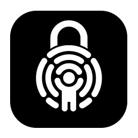
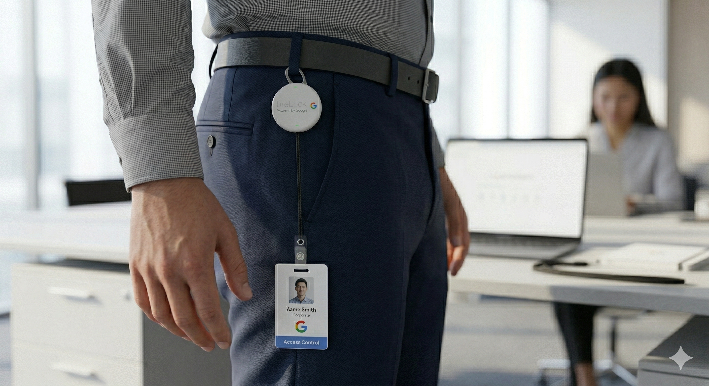
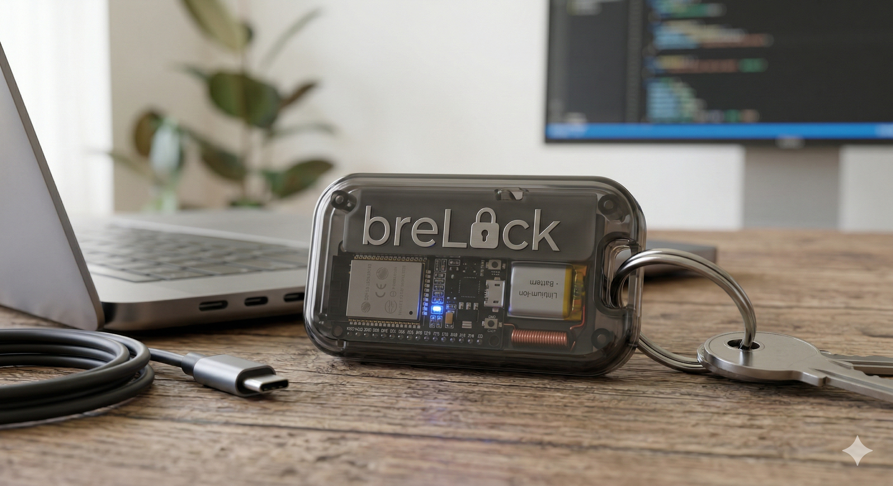
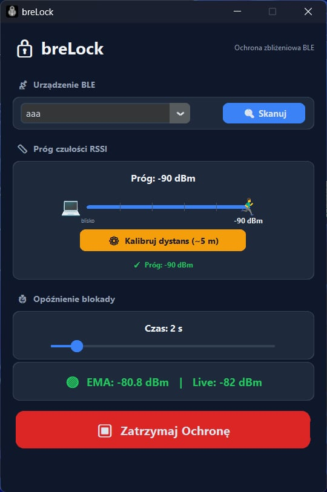

<p align="center">
  
</p>

<h1 align="center">breLock</h1>

<p align="center">
  <strong>Bezpieczeństwo, które dba o siebie samo.</strong><br>
  Inteligentna blokada ekranu oparta na topologii Bluetooth (BLE).
</p>

<p align="center">
  
  
  
  
</p>

---

## 🛡️ O Projekcie

**breLock** to innowacyjne rozwiązanie łączące software desktopowy z fizyczną bliskością użytkownika. Dzięki wykorzystaniu technologii **Bluetooth Low Energy (BLE)**, Twoja stacja robocza automatycznie rozpoznaje, kiedy odchodzisz od biurka i błyskawicznie blokuje dostęp do danych, zanim ktokolwiek niepowołany zdąży zareagować.

To koniec z pamiętaniem o skrócie `Win+L` czy `Cmd+Ctrl+Q`. Twoja obecność jest kluczem.

## ✨ Kluczowe Funkcje

- ⚡ **Błyskawiczna Reakcja**: Blokada następuje w ułamku sekundy po przekroczeniu ustalonej strefy.
- 🎯 **Precyzyjna Kalibracja**: Spersonalizuj dystans działania (np. 1.5m, 3m) w zależności od specyfiki Twojego biura.
- 📱 **Uniwersalny Token**: Jako "klucza" możesz użyć swojego smartfona lub dedykowanego breloka BLE.
- 🎨 **Premium UI**: Nowoczesny ekosystem wizualny – od strony lądowania po interfejs aplikacji desktopowej.
- 🔋 **Zero-Impact**: Minimalne zużycie energii dzięki optymalizacji BLE.

## 🚀 Technologie

### Frontend (Landing Page)
- **Next.js 16** (App Router)
- **Tailwind CSS 4** (Vibrant UI)
- **Vanta.js** (Dynamiczna topologia tła)
- **Framer Motion** (Mikro-animacje)

### Desktop Client
- **Python** (Logic Core)
- **Bleak** (Komunikacja BLE)
- **CustomTkinter** (Modern Desktop UI)
- **PyInstaller** (Kompilacja do .exe / .dmg)

## 📸 Demo & Wizualizacje

<p align="center">
  
  
</p>

### Proces Konfiguracji:
1. **Skanowanie**: Znajdź swoje urządzenie Bluetooth.
2. **Kalibracja**: Ustal bezpieczną odległość.
3. **Aktywacja**: Ciesz się automatyczną ochroną.

<p align="center">
  
</p>

## 🛠️ Instalacja

### Strona WWW (Development)
```bash
cd products/brelock/apps/website
npm install
npm run dev
```

### Desktop App (Windows/macOS)
1. Przejdź do zakładki [Pobierz](http://localhost:3000/pobierz) na stronie lokalnej.
2. Pobierz `breLock_Setup.exe` (Windows) lub `breLock.dmg` (macOS).
3. Zainstaluj i podążaj za instrukcjami kalibracji.

---

<p align="center">
  Stworzone z pasją do cyberbezpieczeństwa. <br>
  <b>breLock Team</b>
</p>
